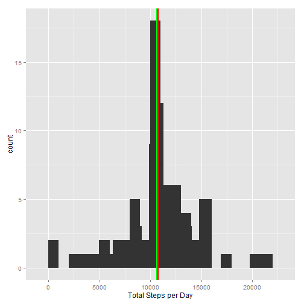

### Author: Jigme Norbu


## Loading and preprocessing the data

* Loading Data

```r
setwd("C:/Users/Jigme505/Desktop/DATA SCIENCE COURSEs/5 - Reproducible Research/")

data <- read.csv("Week 2/activity.csv", na.strings = "NA", header=TRUE)
```

* Processing Data

```r
## assiging the variables
steps <- data$steps
date <- data$date
interval <- data$interval
```
## What is mean total number of steps taken per day?

* Histogram of the total number of steps taken each day

```r
require(dplyr)
total_steps_pday <- tapply(steps, date, FUN=sum, na.rm=TRUE)
total_steps_pday<- data.frame(date=names(total_steps_pday),total_steps = total_steps_pday)
total_steps <- as.numeric(total_steps_pday$total_steps)

## mean and the median
mean_steps <- mean(total_steps)
median_steps <- median(total_steps)

require(ggplot2)
p1 <- qplot(total_steps, data = total_steps_pday, xlab = "Total Steps per Day") 
p1 + stat_bin(aes(x=total_steps), binwidth =1000) + 
     geom_vline(xintercept = c(mean_steps, median_steps), col=c("red","green"), size=c(1,1))
```

 


The Mean is 9354.2295082 and the Median is 1.0395 &times; 10<sup>4</sup>.
The Red line in the graph shows the mean and the green shows the median.


## What is the average daily activity pattern?


In order to find the average daily activity pattern, I took the average of steps per interval. I then plot the time series of the average daily activity over the 5- minute interval period
using the base plotting system.


* Time series Plot


```r
## taking mean over the intervals
steps_p_interval <- tapply(steps, interval, FUN=mean, na.rm=TRUE)
## transforming it into data frame
steps_p_interval<- data.frame(interval=names(steps_p_interval), avg_steps = steps_p_interval)

## assigning the average steps per interval and changing the format of the interval variable
avg_steps <- as.numeric(steps_p_interval$avg_steps)
interval_new <- strptime(sprintf("%04d", as.numeric(names(steps_p_interval$avg_steps))), format="%H%M")

## plot
plot(interval_new, avg_steps, type = "l", xlab="Interval", ylab="Average steps per day")
```

 


* Maximum number of steps


```r
for (i in 1:288) { 
    if (steps_p_interval$avg_steps[i]== max(avg_steps)) {
      
     time <- print(interval[i])}}
```

```
## [1] 835
```


* The 5 minute interval that has the maximum number of steps per day is 835.


## Imputing missing values

I am identifying the number of NAs and replacing them with the overall average steps. Then I am creating a new data set called "data_new" with the replaced NA values.


```r
## is.na() tells which rows have missing values and which ones don't.
## The which() function returns a list of the rows that have missing values.
## length() gives a count of the returned rows.
      
total_NA <- length(which(is.na(data$steps)))

## replacing the NAs
data$steps[is.na(data$steps)] <- round(mean(data$steps, na.rm=TRUE))
  
## new data set           
data_new <- data 
steps_new <- data_new$steps
```

* The total number of missing values in the data set is 2304

* Histogram of the new data


```r
total_steps_pday_n <- tapply(steps_new, date, FUN=sum, na.rm=TRUE)
total_steps_pday_n <- data.frame(date=names(total_steps_pday_n),
                                 total_steps_n = total_steps_pday_n)

total_steps_n <- as.numeric(total_steps_pday_n$total_steps_n)

mean_steps_n <- mean(total_steps_n)
median_steps_n <- median(total_steps_n)

p3 <- qplot(total_steps_n, data = total_steps_pday_n, xlab = "Total Steps per Day") 

p3 + stat_bin(aes(x=total_steps_n), binwidth =1000) + 
  geom_vline(xintercept = c(mean_steps_n, median_steps_n), col=c("red","green"), size=c(1,1))
```

 

* The new Mean is 1.0751738 &times; 10<sup>4</sup> and the new Median is 1.0656 &times; 10<sup>4</sup>.

- So we can see that the means and the median actually differ from the previous case. This is because when we simply remove the NA values and take the average we are taking them to be 0 and so that brings down the mean value. However, if we replace the NA values with the mean value it will reflect a higher average steps per day.


## Are there differences in activity patterns between weekdays and weekends?

* Here I make use of the 'facet_grid()' function from ggplot2 package to create the panel plot for weekdays and weekend. First I create a new factor variable with two levels:"weekend" and "weekdays". Then I plot the time series for the two categories.


```r
data_new$date <- as.Date(data_new$date)

#create a vector of weekdays
weekdays <- c('Monday', 'Tuesday', 'Wednesday', 'Thursday', 'Friday')

#Use '%in%' and 'weekdays' to create a logical vector

# then convert to 'factor' and specify the 'levels/labels'
data_new$Weekday <- factor((weekdays(data_new$date) %in% weekdays), 
                   levels=c(FALSE, TRUE), labels=c('weekend', 'weekday'))


## creating the timeseries plot
steps_p_interval_n <- tapply(steps_new, interval, FUN=mean)
steps_p_interval_n <- data.frame(interval_n=names(steps_p_interval_n),avg_steps_n = steps_p_interval_n)

avg_steps_n <- as.numeric(steps_p_interval_n$avg_steps_n)
interval_n <- strptime(sprintf("%04d", as.numeric(names(steps_p_interval_n$avg_steps_n))), format="%H%M")

## plot
p4 <- ggplot(data_new, aes(x=interval_n, y=avg_steps_n), facet=.~Weekday) + geom_line() 
p4 + facet_grid(Weekday~.)+xlab("Interval") + ylab("Average steps Per Day")
```

 


